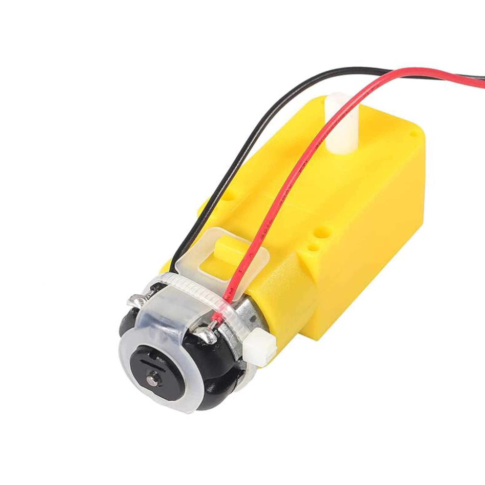
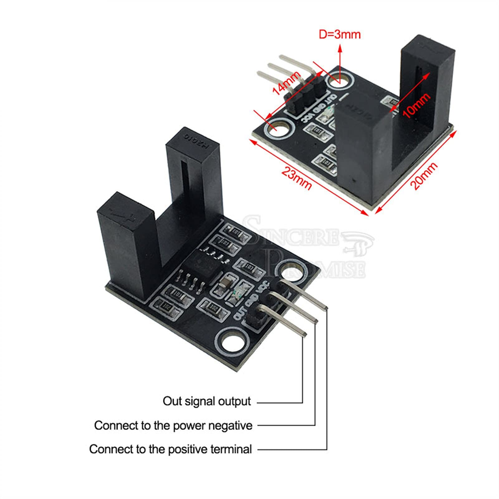
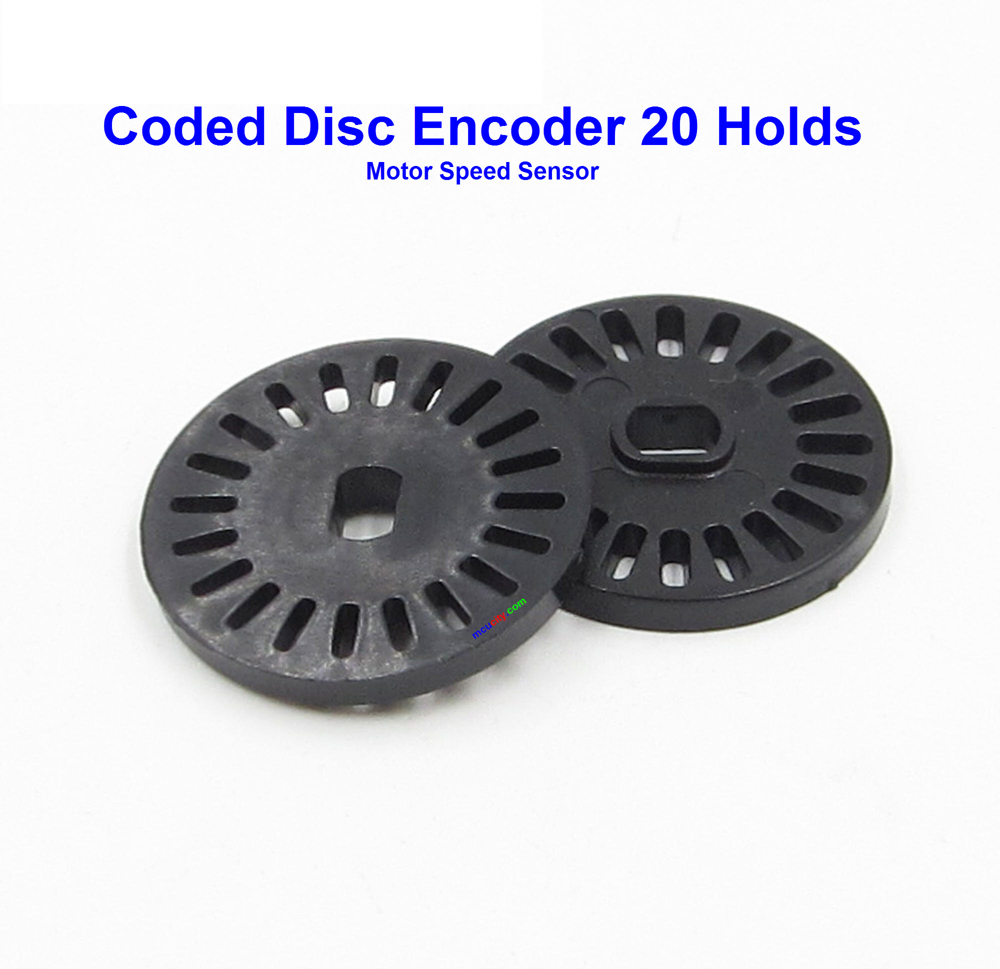
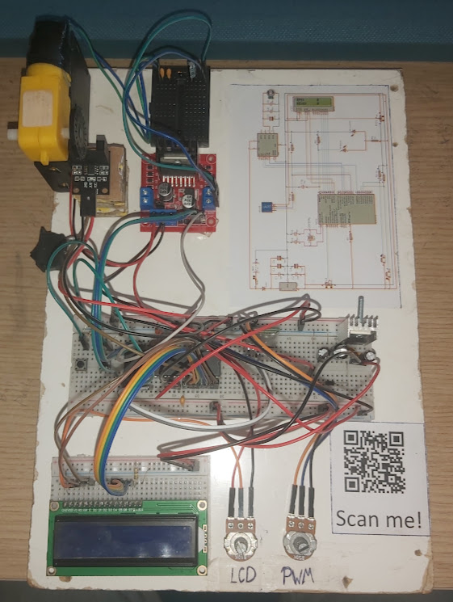
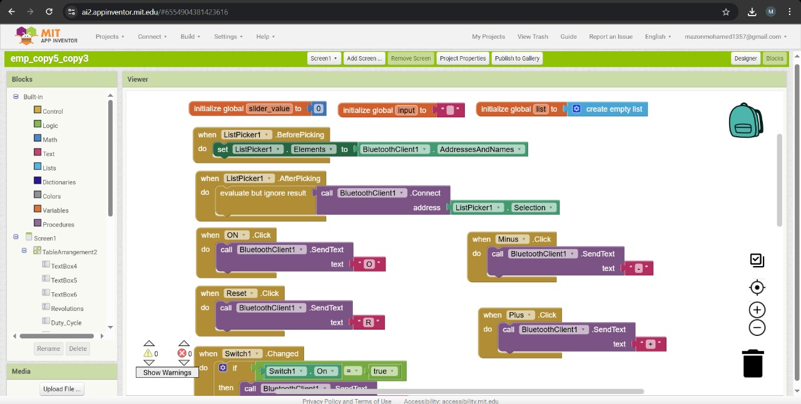
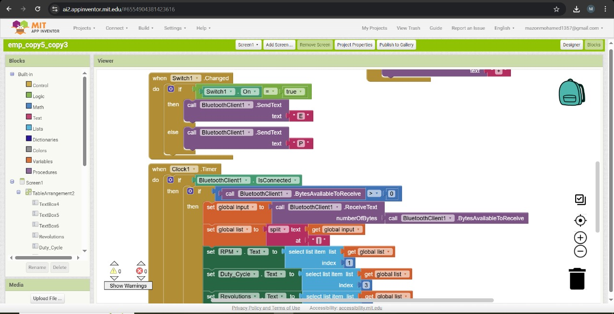
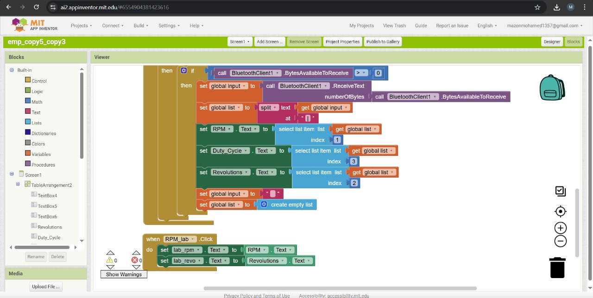
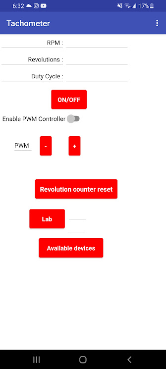

# Tachometer with PIC16F877A

This project implements a **tachometer** system using the **PIC16F877A microcontroller** to measure and monitor the RPM (revolutions per minute) of a DC motor with high accuracy. The RPM is displayed on a 16x2 LCD and transmitted via **UART protocol** to an Android application built using **MIT App Inventor**.

In addition to real-time monitoring, users can remotely:
- **Start/stop the motor**
- **Control its speed** via PWM using either a physical **potentiometer** or the mobile application.

> 📌 **Accuracy:** The system provides highly reliable readings with a typical error margin of less than ±3 RPM, ensuring stable and consistent measurements.

---

## 🔩 Components Used

> `(*)` = essential components

- `*` PIC16F877A Microcontroller  
- `*` 8MHz Crystal Oscillator  
- `*` HC-05 Bluetooth Module  
- `*` Two Li-ion 18650 Battery Cells (3.7V each, total 7.4V)  
- Battery Holder (2×18650)  
- Switch ON/OFF  
- `*` L298N Motor Driver Module  
- `*` 16x2 LCD Display  
- `*` DC Geared Motor (TT Motor / Yellow Motor)  
- `*` Photoelectric Encoder  
- `*` Encoder Disk (with 20 slotted & 20 solid segments)  
- Large / Medium / Small Breadboards  
- `*` Two 10K Potentiometers  
- `*` Two Push Buttons  
- `*` 7805 Voltage Regulator  
- Heatsink for Voltage Regulator  
- `*` 1N5819 Schottky Diode  
- `*` Five 100nF Ceramic Capacitors  
- `*` Two 100μF Electrolytic Capacitors  
- `*` Two 22pF Ceramic Capacitors  
- 470μF Capacitors  
- 10μF Capacitors  
- `*` Multiple Resistors: 10K, 1.8K, 1.3K, 150Ω  
- `*` Plenty of Jumper Wires 

  

 
📷 Geared Motor Photo

  

 
📷 Photoelectric encoder Photo

  

 
📷 Encoder Disk Photo

---

## 📷 Project Images

---

## 📱 Mobile App

- Built using **MIT App Inventor**
- Connects to the microcontroller via Bluetooth
- Displays real-time RPM
- Allows full remote control (start/stop/speed)
- Includes `.apk` file for installation and `.aia` source file

  
 

 
📷 MIT app inventor Bloks 

  

 
📷 Screenshot from the app

### 📥 Download the App

Scan the QR code below to download the APK from my drive:

> 🔗 Or click [here](https://drive.google.com/drive/folders/1uMTk8APghZmzyFvr8DgvHVg_q9328N2L?usp=sharing)

### 📲 App Usage & Features

The mobile app offers a user-friendly interface to monitor and control the motor in real-time via Bluetooth. Below is a breakdown of its setup, interface, and capabilities:

#### 🔧 Initial Setup

1. **Enable Bluetooth** on your Android device.
2. Pair it with your Bluetooth module (usually named `HC-05`).
   - Default PIN: `1234` or `0000`
3. Open the app and tap **"Available devices"**.
4. A new screen will appear showing all paired devices. Select your module to establish a connection.

> 💡 **Tip:**  
> You can rename your Bluetooth module or change its password using **AT Commands** in AT mode via an Arduino.  
> [🔗 Learn how to enter AT mode and send commands](https://www.martyncurrey.com/arduino-with-hc-05-bluetooth-module-at-mode/)

#### 🎛️ App Interface Overview

- **Live Data Display**
  - RPM (Revolutions Per Minute)
  - Total Revolutions
  - PWM Duty Cycle (%)

- **Motor Control**
  - Power button (ON/OFF)
  - Mode switch to toggle between:
    - Physical control using a potentiometer
    - App-based PWM control
  - Two buttons to increase (+) or decrease (−) motor speed

- **Data Tools**
  - **Reset Counter**: Resets the revolutions counter, useful for fresh testing intervals.
  - **Lap Button**: Captures the current RPM and revolution values at a specific time.  
    You can use this to compare RPM after a certain duration (e.g., 1 minute).

### ⭐ App Highlights

- 🔌 **Wireless Control**: Start, stop, and adjust speed remotely via Bluetooth
- 🔄 **Dual PWM Control Modes**: Choose between physical and app-based control
- 📊 **Real-Time Monitoring**: Accurate and stable display of motor RPM and revolutions
- 🧪 **Performance Testing Tools**: Revolution reset and lap logging features for data analysis

---

## 🧠 How It Works

The system uses an IR encoder sensor to count how many solid segments of the encoder disk pass in a time period **T**, then applies the following formula:

RPM = (Number of pulses detected in T / T) × (60 / N)

Where:
- `T` = measurement window in seconds
- `N` = number of solid segments on the encoder disk (in this case: 20)

---

## 📁 Repository Structure
<pre>
Tachometer with PIC16F877A/
├── images/
|   ├── Components/
│   |   ├── Encoder_disk.jpg
│   |   ├── Photoelectric_encoder.jpg
│   |   └── TT_Motor.jpg
|   ├── MITblocks/
|   |   ├── Bloks1.jpg
|   |   ├── Bloks2.jpg
|   |   └── Bloks3.jpg
|   ├── MobileApp/
│   |   ├── AppQRcode.jpg
│   |   └── screenshot.jpg
│   └── Tachometer.jpg
├── tachometer src/
│   ├── Techometer_Src.asm
│   ├── Techometer_Src.c
│   ├── Techometer_Src.hex
│   └── Techometer_Src.mcppi
├── Techometer Mobile App/
│   ├── Tachometer App.apk
│   └── Tachometer MIT app inventor Project.aia
├── LICENSE
├── README.md
└── Tachometer schematic diagram.pdf
</pre>

---

## ⚠️ Notes for Replication

- Make sure to add a **voltage divider** (using 1.8K and 3.3K resistors) on the RX pin of the Bluetooth module to avoid damaging it.
- It is recommended to install a **heatsink** on the 7805 voltage regulator.
- Ensure **proper capacitor values** are used around the regulator for power stability.
- Double-check the orientation of all polarized components (diodes, electrolytic capacitors, etc.)

---

## 👥 Team Members

- **Ahmed Waheed**   
- **Eslam Dahy**  

---

## 📜 License

This project is released under the [MIT License](LICENSE) — feel free to use, modify, and share with proper attribution.

---